# Tổng quan về Linux
## - Xem dung lượng Disk
1. Xem bằng ứng dụng mặc định trong ubuntu là “Disk Usage Analyzer” hoặc “Disks”
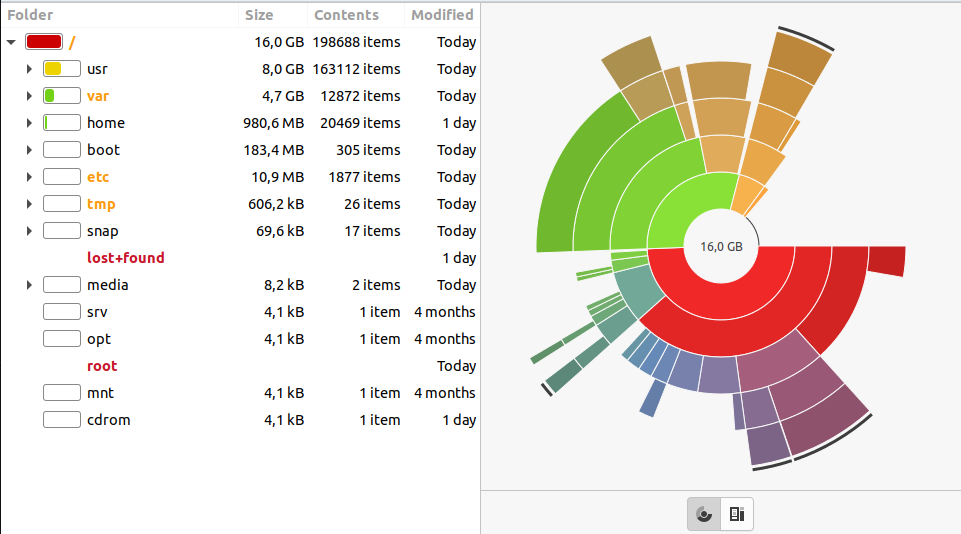
1. Xem bằng GUI Tools của bên thứ 3
1. Dùng lệnh df (có thể kèm tham số -h cho các phần có thể đọc được)
1. Hiển thị bao gồm các thông tin chi tiết về dung lượng disk còn trống, dung lượng đang sử dụng, thông tin về disk đang chạy, nhiệt độ,…
## - Xem phân vùng Disk
1. xem bằng GUI tools là Gparted
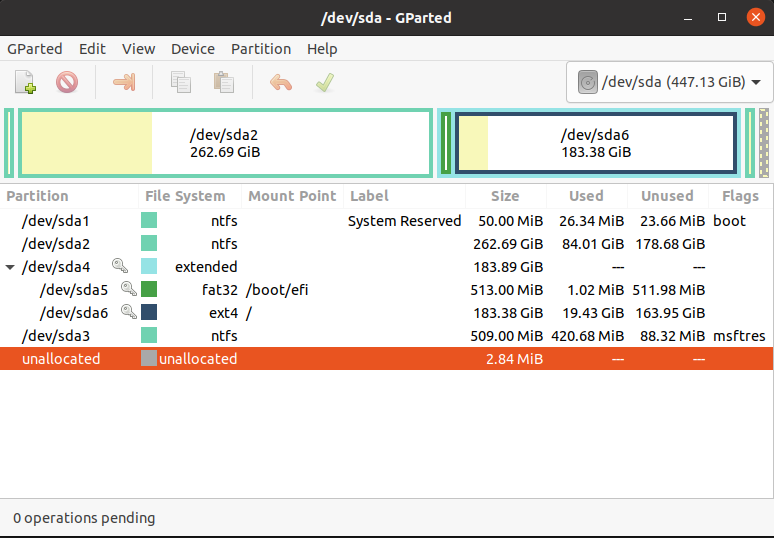
1. Dùng lệnh cfdisk hoặc fdisk (chạy ở quyền root)

Trong đó: 
* cfdisk cho phép list tạo xóa và resize phân vùng
* fidsk cho phép list ,tạo và xóa phân vùng (--help với các option khác nhau cho việc tương tác với các phân vùng)
```
$ sudo fdisk --help
```
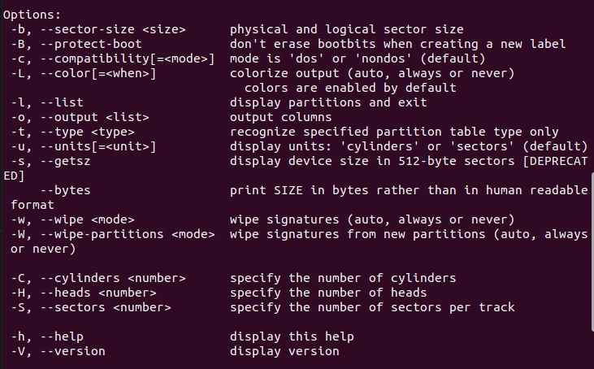

## - Xem thông tin phần cứng
_**Toàn bộ thông tin được dùng bằng command line**_
1. lscpu: cung cấp thông tin về cpu và các đơn vị xử lí liên quan
    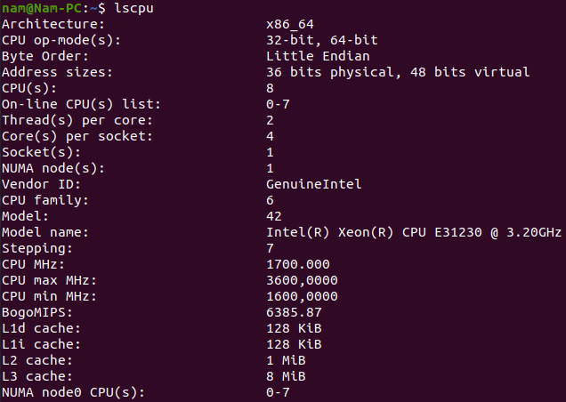
1. lspci: cung cấp thông tin các bus PCI và các linh kiện bên ngoài kết nối với chúng

    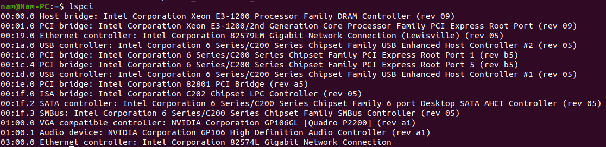
1. lshw: cung cấp thông tin chi tiết, ngắn gọn về mọi linh kiện trong máy từ motherboard, cpu, RAM,… (với lệnh `lshw -short` sẽ hiển thị đơn giản hơn)

    
1. lsscsi: liệt kê các ổ disk đang sử dụng
1. lsusb: liệt kê các usb controller, hiển thị chi tiết về thông tin chúng kết nối với máy, mặc định sẽ ngắn gọn, để có nhiều thông tin chi tiết hơn dùng `lsusb -v`
1. kiểm tra lượng ram trên máy dùng lệnh `free`, để dễ hiểu hơn sử dụng lệnh `free -m`
* `ls option`: tổng hợp các option phổ biến khi dùng `ls`

## - Theo dõi chi tiết tiến trình
_**Cần thực hiện trên quyền root**_

* `$ sudo ps -a`: hiển thị mọi tiến trình có trên máy, kèm PID, thời gian thực thiện và lệnh thực hiện 
* `$ sudo ps -sa`: hiển thị ID tiến trình, ID unix của user, trạng trái thực thi, thời gian, lệnh thực hiện
* `$ sudo ps -u`: hiển thị user, ID tiến trình, % hệ thống hoạt động, trạng thái, thời gian và lện thực hiện
## - Liệt kê danh sách file/folder

Dùng lệnh `ls` để liệt kê các file hiện có tại vị trí trỏ hiện tại cùng các option có điều kiện:

`$ ls [options] [file|dir]` để tìm ở 1 file được chỉ định trước

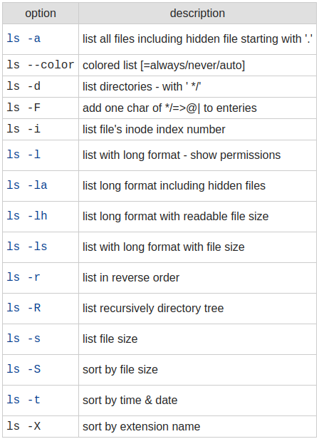

## - Tương tác với file/folder
* Sao chép: lệnh `cp` để sao chép file/ folder mới được chỉ định trước vào vị trí mới 

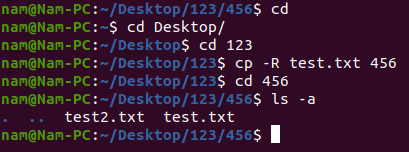

syntax: `cp -R <source_folder> <destination_folder>`
* Với trường hợp sao chép vào phân vùng backup hay remotely host server dùng 2 lệnh sau:(yêu cầu thực hiện sudo apt-get install rsync )
```
rsync -ar <source folder/file> <destination_user>@<ipserver>:<destination folder/file/>
``` 
```
scp -r <source_folder> <destination_user>@<destination_host>:<ip server>
```
* Di chuyển: lệnh “mv” để di chuyển file/folder được chỉ định tới vị trí mới

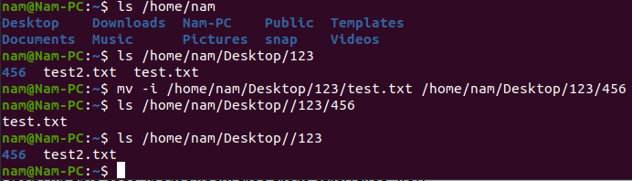

```
mv [option] <source_file> </destination_folder>
```
Để đổi tên file dùng lệnh: `mv [option] <source> <destination>`

Có thể di chuyển từng file, nhiều file hoặc tất cả file có cùng định dạng 

    -i :để xác nhận ghi đè hay không
    -f :để tắt thông báo xác nhận ghi đè (trường hợp thực hiện nhiều file liên tục)
    -n :để chặn ghi đè file đã tồn tại
    -b :để sao lưu file đã có trước đó
    -v :để hiện thông báo tiến trình di chuyển từng file

* Tìm: dùng lệnh “find” kèm với đường dẫn vào file cần tìm để ra kết quả chính xác nhất bằng đệ quy

```
find /path/ -type f -name file-to-search
```
    /path: nơi bắt đầu tìm
    -type [option]: định dạng file cần tìm 
    (f-regular file, d-directory, b-block, l-symbolic link, c-character device)
    -name: tên file cần tìm 
Có thể kết hợp lệnh `mv` và `rm`(remove) để lọc file tốt hơn

Ngoài ra lệnh `locate` cũng được dùng tương đương lệnh `find`, nhưng thời gian nhanh hơn do dùng cơ sở dữ liệu xây dựng từ trước, trong khi `find` quét hệ thống theo thời gian thực 


## - Phân quyền cơ bản và phân quyền nâng cao

```
$ sudo ls -l <file>
```
cấu trúc của 1 phân quyền file bao gồm :

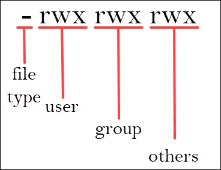

1. file type: trong đó
    1. "-" regular file
    1. "d" directory
    1. "i" link
1. user: người sở hữu
1. group: nhóm user
1. others: bất kì đối tượng không thuộc nhóm và không phải user sỡ hữu file
- 'r' : read giá trị = 4
- 'w' : write giá trị = 2
- 'x' : execute giá trị = 1
- '-' : deny giá trị = 0

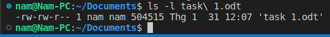

Giá trị quyền lúc này của file task 1.odt
|  file type |   user   |    group  | others |
|------------|----------|-----------|--------|
|     -      |   rw-    |    rw-    |    r-- |
|regular file|  6       |   6       |   4    |

Để thay đổi giá trị phân quyền tiêu chuẩn có 2 cách:
- Chế độ symbolic
- chế độ kí hiệu bát phân (octal nonation)

ví dụ: để thay đổi quyền của file task 1.odt thành tất cả chỉ đọc và chỉ người sở hữu có thể thực thi, sử dụng lệnh (octal nonation)
```
chmod 744 task 1.odt 
```
hoặc `chmod u=rwx,g=r,o=r task 1.odt` (symbolic mode)

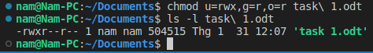

Để thây đổi phân quyền nâng cao , sử dụng lệnh `chown`, có thể thay được group và owner ban đầu (yêu cầu quyền root)

```
$ sudo chown [new-user] [file]
$ sudo chgrp [new-group] [file]
```
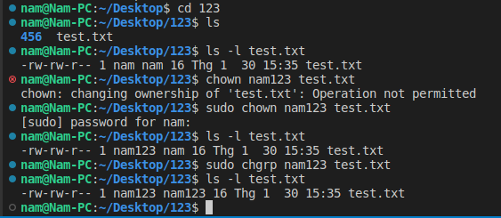

## - Mount và Umount
Để kiểm tra phân vùng ổ cứng, dùng lệnh `lsblk` để hiển thị toàn bộ phân vùng đang có trên máy

Có 2 cách mount ổ cứng bằng device file hoặc UUID của ổ cứng đó
- Cách 1: device file
```
$ sudo mount [/dev/disk-name] [/mount-file-name]
```
Là hình thức mount tạm thời, sẽ bị mất sau khi reset hoặc shutdown máy
- Cách 2: mount bằng UUID

Để ổ có thể mount tự động sau khi mở máy, sử dụng UUID của ổ đó để mount
sử dụng `blkid` hoặc list toàn bộ UUID phân vùng ổ cứng như sau:
```
lsblk -o NAME,UUID,SIZE
```
Sau khi lấy được UUID ổ cần tìm, cần chỉnh sửa file "/etc/fstab"
thêm lệnh mount vào cuối file hoặc dùng `echo` thay thế
```
UUID =[uuid của ổ cần mount] [/file-to-mount] ext4 default 0 0
```
Sau đó lưu lại chỉnh sửa file và dùng lệnh ` $ sudo mount -a` để hoàn tất
 ## - Các trình text editor 
 Có rất nhiều trình text editor khác nhau trên cả version Ubuntu chính thức và các bản mở rộng, tùy biến khác
 Trong đó có 5 trình text editor phổ biến được sử dụng nhiều nhất:
 1. Vim/Vi
 1. Nano
 1. Gedit
 1. Emacs
 1. Sublime Text

Để hình dung rõ hơn giao diện làm việc của từng text editor, ví dụ có file "test1.txt" ở trong đường dẫn `/Desktop/123` như sau:

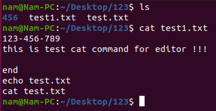

### Vim/Vi
Sử dụng lệnh `vi [file]` (trong 1 số trường hợp, `vi` là text editor mặc định thay cho vim buộc phải cài đặt và ngược lại)

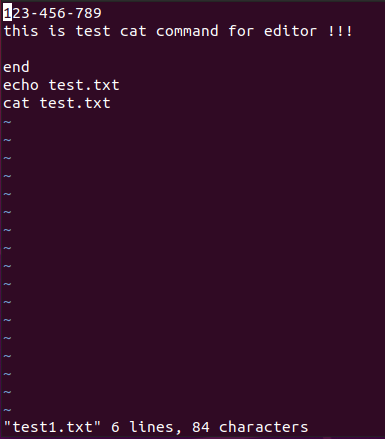  --------- Giao diện của Vim editor ---------

Vim có 2 mode: 
- Command mode: nội dung trong file được xem là các lệnh cần thực thi, đây cũng chính là mode mặc định khi mở file text bất kì

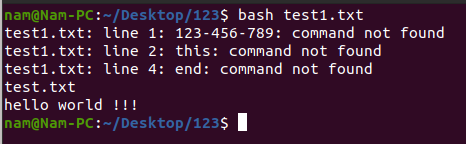

- Insert mode: cho phép user chỉnh sửa nội dung trong file, để vào mode này nhấn nút __Esc__ để thoát command mode sau đó nhấn nút __"i"__ để chỉnh sửa nội dung

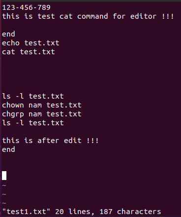

Và để thực thi các lệnh trong file, cần dùng lệnh:
```
$ sudo bash [file]
```
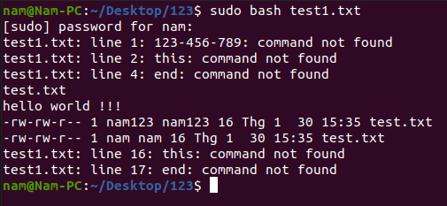

Kết quả khi áp dụng cho file __test1.txt__ thấy được phân quyền owner và group đã thay đổi từ __nam123__ thành __nam__

Ngoài ra còn có rất nhiều command khác phục vụ cho Insert mode
có thể tham khảo tại [Basic Vi Commands](https://www.cs.colostate.edu/helpdocs/vi.html)
### Nano
Nano là một trình chỉnh sửa trực tiếp. Nó được thiết kế cho cả người mới bắt đầu và người dùng nâng cao và có nhiều tính năng tùy biến.
```
nano [file]
```
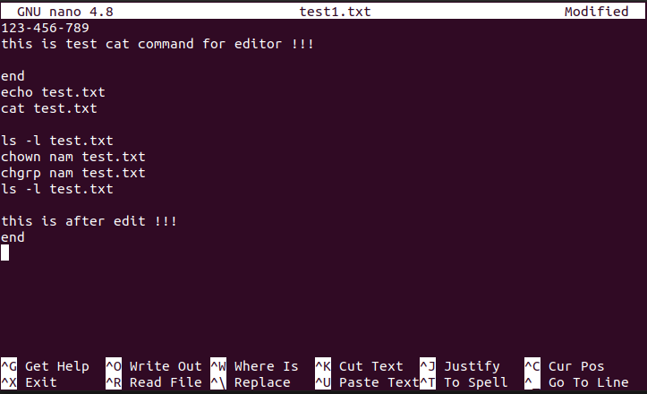

Mặc định khi dùng `nano` để mở file sẽ ở dạng _modified_
### Gedit
Đây là trình text editor mặc định cho mội trường GNOME desktop

Khi mở file text bất kì, trình editor Gedit sẽ là ưu tiên 

Gedit có đầy đủ các tính năng cơ bản của trình soạn thảo văn bản tiêu chuẩn với giao diện đơn giản hơn

Ngoài ra Gedit có thể  hỗ trợ 1 vài ngôn ngữ lập trình và hầu hết các dạng họ font chữ

Có 2 cách sử dụng Gedit: double click vào file cần mở hoặc dùng lệnh `gedit [file]` mở trực tiếp

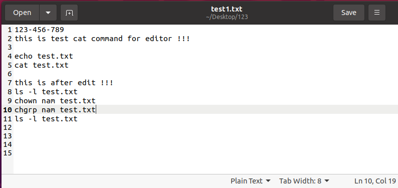
### Sublime Text

Đây là dạng soạn thảo văn bản dựa trên IDE rất phổ biến

Sublime có hỗ trợ nhiều plug-in dành cho lập trình và mark-up

Có 1 số tính năng khác:
- Có sẵn hệ thống bản lệnh đa đạng
- Là API dựa trên Python
- Hỗ trợ edit code song song
- Có 1 số option riêng cho R&D dự án

Tương tự Gedit, sublime có mở từ kho ứng dụng hoặc command `subl` (yêu cầu cài đặt trước)

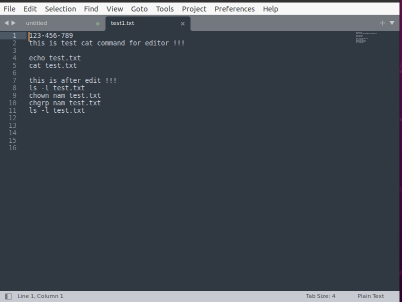

```
wget -qO - https://download.sublimetext.com/sublimehq-pub.gpg | sudo apt-key add -  

sudo apt-get install apt-transport-https  

echo "deb https://download.sublimetext.com/ apt/stable/" |  
 sudo tee /etc/apt/sources.list.d/sublime-text.list  .

apt-get update  

sudo snap install sublime-text --classic
```
### GNU Emacs
 Được xem là trình text editor lâu đời nhất nhưng độ phổ biến vẫn rất cao nhờ tính ổn định cũng như sự tối ưu và đơn giản của nó

 Ngoài ra còn có 1 số tính năng khác:
 - Tích hợp option mail và tin tức
 - Tính năng mở rộng về giao diện debugger
 - Cung cấp và hỗ trợ gói văn bản mở rộng

 Do không được tích hợp sẵn vào OS nên cần cài đặt trước
 ```
 sudo apt update
 sudo apt-get install emacs
 ```
 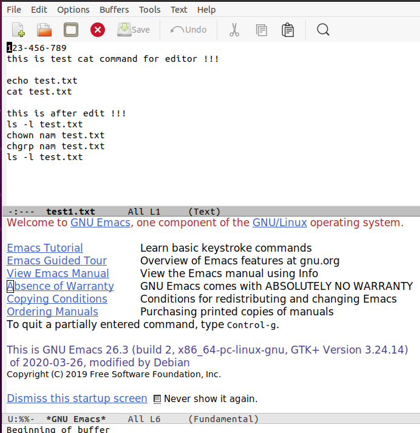

 ## - Symbolic Link
Đơn giản đây là 1 đường dẫn local trỏ đến vị trí file/foler được chỉ định

Giúp user dễ dàng thao tác với terminal cũng như truy cập, quản lý file dễ dàng hơn, đặc biệt đây là file độc lập gốc nên dù bị xóa cũng không ảnh hưởng các file khác
```
ln -[option] [target file] [Symbolic filename]
```
|Command Switch         |	Mô tả                                               |
|-----------------------|-------------------------------------------------------|
|–backup[=CONTROL]      | 	backup từng file gốc                                |
|-d, -F, –directory     | 	superuser được cho phép hard link                   |
|-f, –force             | 	file đích bị xóa                                    |
|-I, –interactive       | 	thông báo trước khi xóa file đích                   |
|-L, –logical           | 	chọn file gốc là symbolic links                     |
|-n, –non-dereference   | 	symbolic links tới thư mục được xem như là files    |
|-P, –physical          | 	tạo hard links trực tiếp tới symbolic links         |
|-r, –relative          | 	tạo symbolic links tương đối tới link location      |
|-s, –symbol            |	tạo symbolic links thay vì hard links               |
|-S, –suffix=SUFFIX     |	ghi đè lên backup suffix thông thường               |
|-v, –verbose           |	in ra tên của từng linked file                      |

- Symbolic link cho file


- Symbolic link cho folder

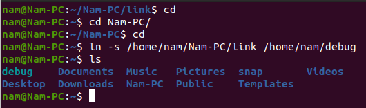

Giống như việc tạo 1 shortcut, user có thể truy cập ngay file của folder đó ngay bên ngoài mà ko cần phải tìm kiếm dù các file đó nằm gần hay xa gốc tree-folder

- Xóa symbolic link

có thể dùng `unklink` hoặc `rm` với hiệu quả tương đương
```
unlink [symbolic link]
rm [symbolic_link name]
```
## - Hard link

Bên cạnh symbolic link thì hard link(dạng liên kết cấp độ thấp) cũng có những tính năng tương tự và syntax không thay đổi
```
ln [origin-file] [hardlink-file]
```

Tuy nhiên cả 2 cũng có 1 vài nhược điểm và có thể bù trừ cho nhau
|Hard link                                                          | symbolic link     |
|-------------------------------------------------------------------|-------------------|
|Chỉ liên kết được tới file, không liên kết được tới thư mục        | 	Có thể liên kết được tới thư mục|
|Không tham chiếu được tới file trên ổ đĩa khác                     | 	Có thể tham chiếu tới file/thư mục khác ổ đĩa|
|Liên kết tới một file vẫn còn ngay cả khi file đó đã được di chuyển| 	Liên kết không còn tham chiếu được nữa nếu file được di chuyển|
|Được liên kết với inode tham chiếu vật lý trên ổ cứng nơi chứa file| 	Liên kết tham chiếu tên file/thư mục trừu tượng mà không phải địa chỉ vật lý. Chúng được cung cấp inode riêng của mình|
|Có thể làm việc với mọi ứng dụng                                   | 	Một số ứng dụng không cho phép symbolic link|
## - Nén-giải nén file/folder
Là ứng dụng mặc định có sẵn trên OS, cho phép nén nhiều file với nhau để tạo file mới có dịnh dạng phù hợp (chủ yếu cho truyền tải dữ liệu)
```
zip [zip-name] [file 1] [file...n]
unzip [zip-name]
```
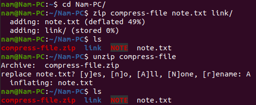

Giải nén tất cả trừ 1 file:
```
unzip [compress-file] [file-to stay]
```

Giải nén tất cả váo folder chỉ định:
```
unzip [compress-file] -d [desination folder] [file-to-stay]
```
Ghi đè file khi giải nén:
```
unzip -o [compress-file]
```
Liệt kê mọi file có trong file nén:
```
unzip -l [compress-file]
```
Kiểm tra, xác minh file khi giải nén:
```
unzip -t [compress-file] [file-to-stay]
```
Ngoài ra vẫn còn các option khác đi kèm lệnh `unzip -h`

## - Đo lưu lượng mạng sử dụng
Có rất nhiều tools phổ biến sử dụng để kiểm tra, đo lường băng thông lưu lượng mang đang sử dụng theo thời gian thực 

Trong đó __netstat, nethogs__ và __nload__ được sử dụng phổ biến vì tính trực quan cũng như chi tiết thông số

### Nethogs
Điểm mạnh của __nethogs__ chính là do được lưu lượng theo PID riêng lẻ, giúp xác định, quản lý dễ dàng hơn từng task của từng user khác nhau đang sử dụng mạng

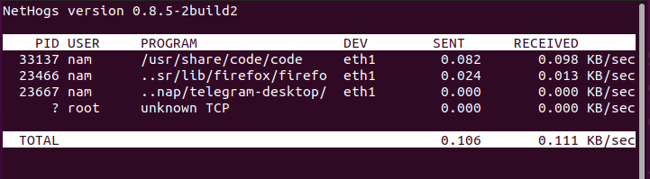

### Nload

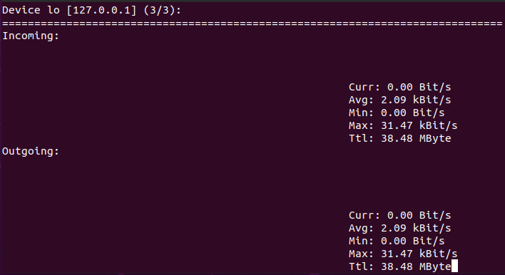

Tính năng nổi bật của nó là hiển thị thông số trực quan
Đo được lưu lượng tối thiểu-tối đa-trung bình-hiện tại và TimeToLive của gói

Tuy nhiên __nload__ lại không thể đo chi tiết từng task hay user bằng PID như __nethogs__ do đó đã làm hạn chế khả năng của nó
### Netstat
Là 1 tool CLI phổ biến về đo lưu lượng mạng cùng với rất nhiều option khác nhau phục vụ cho hiển thị thông số, đo lường, kiểm tra khác nhau

Dùng lệnh `netstat --help` để nắm rõ được các option có sẵn

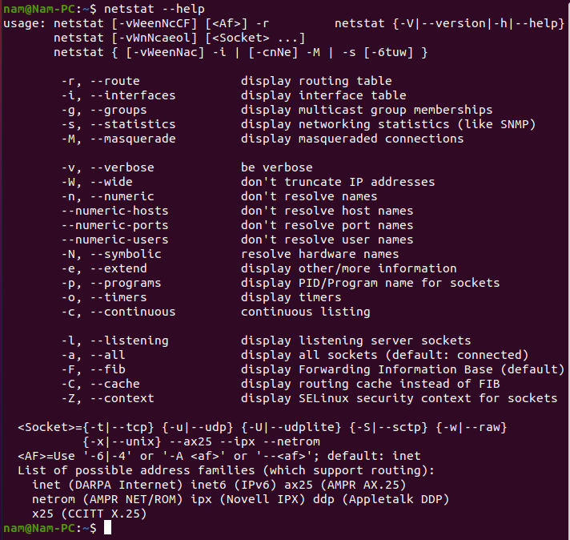

Đây là 1 số option tiêu biểu được sử dụng trong __netstat__
- __-a__: Hiển thị tất cả các sockets, kể cả listening và non-listening
- __-l__: Hiển thị các socket đang lắng nghe
- __-t__: Chỉ hiển thị các kết nối tcp
- __-u__: Chỉ hiển thị các kết nối udp
- __-n__: Xem địa chỉ số (không phân giải)
- __-p__: Hiển thị chương trình PID cho từng socket
- __-r__: Hiển thị bảng định tuyến
- __-s__: Pull và hiển thị thống kê mạng được sắp xếp theo giao thức
- __-i__: Hiển thị danh sách các giao diện mạng
### Iftop
Là 1 tool chỉ được sử dụng bởi quản trị hoặc nhưng người có đặc quyền giám sát, __iftop__ đo và lắng nghe lưu lượng băng thông mạng theo thời gian thực được gán tên chỉ định và hiển thị bảng thông số theo cặp ghép host

__iftop__ sẽ đo lường lưu lượng qua từng socket mạng riêng lẻ, tuy nhiên lại không trả được kết quả của từng tên hay ID cụ thể mà chỉ chung trên 1 cổng kết nối cụ thể nhưng iftop sẽ có lợi thế đặt các filter chỉ định trước qua đó lọc lưu lượng và trả kết quả băng thông đang sử dụng

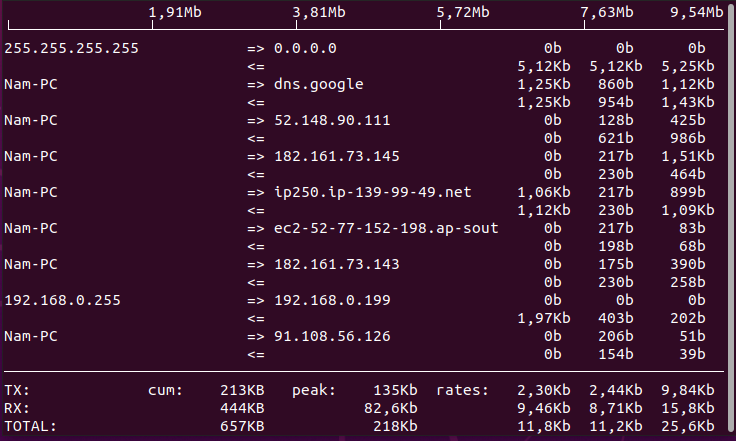
## - Xem nội dung không cần text editor
Trong trường hợp các text editor không hoạt động như mong muốn nhưng user vẫn cần hiển thị nội dung file, có một vài lệnh giúp thực hiện việc đó
### Cat
Là 1 trong những lệnh cơ bản nhất khi mới làm quen Linux
`cat` được dùng để hiển thị mọi nội dung của mọi file có trong máy mà không cần bất kì text editor nào

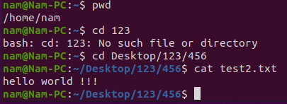
### less và more
Bên cạnh `cat`, lệnh `less` và `more` là 2 lệnh được gợi ý nhiều nhất khi luyện tập thao tác trên Linux
DÙ tương tự __cat__ chỉ để hiển thị nội dung file nhưng __less__ và __more__ lại có cách làm khác
- `less` command:

Hiển thị 1 trang nội dung file cho 1 lần, để tiếp tục cần nhấn __enter__ hoặc __space__, để thoát nhấn _q_ rồi _enter_

- Có 2 option chính khi dùng với __less__
    1. `less -N [file]` giúp hiển thị số dòng 
    1. `less -X [file]` giúp hiển thị hết nội dung mà không biến mất khi quay về Terminal
- `more` command:

__more__ khá giống với __less__ khi chỉ hiển thị 1 phần nội dung, để tiếp tục cần nhấn __enter__, tuy nhiên vào cuối file sẽ tự mất và thoát khỏi trình hiển thị nội dung

### head và tail
2 lệnh này rất nhau và thường sử dụng để hiển thị số dòng nội dung đầu hoặc cuối file tương ứng

Kết hợp option `-n[number-of-line]` để chọn hiển thị số dòng nội dung tùy ý
```
head -n 15 ./Document/text/txt (hiển thị 15 dòng nôi dung đầu file)
tail -n 4 ./Desktop/memlist.txt (hiển thị 4 dòng nội dung cuối file)
```
## - Đổ  nội dung 1 chuỗi vào cuối file
### 1. Chèn trực tiếp vào file
Có 2 cách đề chèn nội dung mới vào cuối file bất kì
- Sử dụng lệnh `cat >>`
- sử dụng lệnh `tee`

```
cat >> [file-name or /path]
```
Cho phép user thêm nội dung mới (không ghi đè) vào cuối file


```
tee -a [file-name or /path]
```
Tương tự lện __cat__ nhưng với option [-a] để tránh bị ghi đè nội dung cũ của file

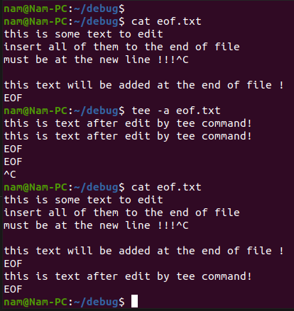

### 2. Chèn nội dung từ file khác
```
cat [file-name or /path] | tee -a [file-name or /path]
```
Lệnh tee sẽ sao chép văn bản từ đầu vào (bên trái của lệnh) và ghi nó vào đầu ra (bên phải của lệnh) rồi trả lại kết quả sau khi chèn thành công


Trong đó:
Lệnh `cat` sẽ hiển thị đoạn text sẽ được thêm vào

Lệnh `tee -a` để bất đầu chèn (không ghi đè) vào file chỉ định

Trước đó, đoạn _**new text**_ sẽ được copy lại và chèn vào cuối file tại line mới sau đoạn _**origin text**_ để  thành đoạn _**after edit**_ của file mới
## - Tìm hiểu Standard Input/Output/Error
Trên hầu hết các hệ điều hành nói chung và Linux/Unix nói riêng thì có 3 dòng xuất nhập chuẩn (I/O) là STDIN, STDOUT và STDERR mà chức năng tương ứng là dòng nhập chuẩn, dòng xuất chuẩn và dòng xuất lỗi chuẩn. Chúng được gọi là các open file và hệ thống gán cho mỗi file này một con số gọi là file descriptor. Ba con số tương ứng với 3 dòng xuất nhập chuẩn ở trên là 0, 1 và 2. Cụ thể:
- standard input -> stdin -> 0<
- standard output -> stdout -> 1>
- standard error -> stderr -> 2>

Trong hầu hết mọi OS thì _standard input_ là nơi dòng dữ liệu đi vào để xử lí từ trình chỉ đạo cố định mà điển hình là keyboard

Đối với _standar output_ chính là  monitor, nơi dòng dữ liệu đi ra

Còn _standard error_ cũng là monitor, nơi dòng xuất lỗi xuất ra

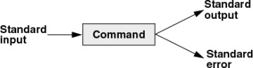

### Redirection (chuyển hướng)
Thay vì nhập xuất thông tin từ các thiết bị keyboard, monitor  theo chuẩn, thì chúng ta sẽ chuyển hướng nhập xuất đó bằng tệp tin hoặc tiến trình khác

Một tiến trình linux gồm 3 luồng dữ liệu chuẩn: stdin, stdout và stderr

Thì khi chuyển hướng chúng ta cũng có 3 luồng dữ chuyển hướng: input, output và error redirections
- Redirecting Standard Input:
Để chuyển hướng của __stdin__ sử dụng kí tự __"<"__
- Redirecting Standard Output:
Để chuyển hướng của __stdout__ sử dụng dấu __">"__ hoặc __"1>"__

Trong trường hợp trống sẽ tạo file mới, nếu đã có file sẵn sẽ ghi đè lên file cũ, để không ghi đè file cũ cần dùng __">>"__ hoặc __"1>>"__

- Redirecting Standard Error: 
Thường dòng xuất lỗi luôn ra monitor trước, gây mất tính liền mạch khi quản lý thông tin, có thể chuyển hướng __stderr__ vào 1 file chung

Sử dụng __"2>"__ hoặc __"2>>"__(tránh ghi đè) để chuyển hướng
### /dev/null
Trong một cài trường hợp, việc dòng xuất lỗi và dòng đầu ra hoạt động liên tục và có thể khiến file to hơn dần, hoặc đơn giản là user khi thực thi lệnh không muốn hiển thị thông tin output hay error

Do đó giải pháp là chuyển hướng __"stdout"__ và __"stderr"__ đến __""/dev/null""__, là 1 file rỗng đặc biệt trong linux, nó sẽ tự động loại bỏ mọi file được đưa vào đây

## -Các lệnh thường gặp
- mkdir: tạo folder ở vị trí đường dẫn hiện tại của user
- tee: chèn nội dung mới vào cuối file
- ln: link file/folder thành 1 shortcut
- ping: kiểm tra trạng thái mạng giữa thiết bị đầu cuối qua IP, cơ chế hoạt động gửi 1 loạt thông báo ICMP cho thiết bị từ host source tới host destination, qua đó đo thơi gian xử lý phản hồi tính bằng ms, xem được tình trạng mạng và lượng packet di chuyển ổn định hay không 
- rsyn: sao chép file vào phân vùng backup hay server từ xa 
- wc: word count đếm số từ có trong nội dung của file, số dòng và số bytes

Option:

-l: đếm toàn bộ kí tự 

-m: đếm toàn bộ bố có mặt 

-c: đếm số bytes t

-w đếm số từ 

- wget: công cụ hỗ trợ tải nội dung từ internet

Bên cạnh đó có nhiều tính năng khác như: tải đa nội dung, chạy dưới nền, phục hồi tiến trình tải, giới hạn băng thông,... cũng như có thể kết hợp các lệnh khác trên Linux

```
wget [link-to-download]
```
__stdout__ của wget sẽ là thanh tiến trình tải

1. Giao diện phía trên có bố cục ô chưa sau:
1. tên file đang tải
1. thanh tiến trình % tải thành công
1. số file đang tải
1. tốc độ mạng
1. thời gian còn lại để hoàn thành

```
wget [option] [URL/isos.txt]
```
|option| Mô tả|
|-----|-----|
|-q|tắt mọi thông tin I/O trong quá trình tải|
|-nv   |tinh giản thông tin I/O, để lại 1 số thông tin quan trọng   |
|-c|phục hồi quá trình tải sau khi có sự cố làm mất internet|
|-i|tải nhiều URL(chia mỗi link 1 dòng, gom vào 1 file là isos.txt)|
|--limit-rate|giới hạn băng thông tải (`wget --limit-rate [number of rate]`)|
|-b|tải dưới nền|
|-o|chuyển hướng output của `wget`|
|-a|chèn thêm vào log output của `wget`|

Ngoài ra còn nhiều option khác tại [wget-optional](https://www.gnu.org/software/wget/manual/wget.html)

- grep

Là câu lệnh tìm kiếm mẫu kí tự và hiển thị toàn bộ các mẫu nội dung có chứa ký tự đó, `grep` là viết tắt của Global search for Regular Expression and Print out (G.R.E.P)

|Options| Mô tả|
|-----|-----|
|-c | chỉ hiện vài dòng khớp với mẫu|
|-h | hiện các dòng trùng khớp mà không hiện tên file|
|-i | bỏ qua nội dung trùng|
|-l | chỉ hiện danh sách tên file|
|-n | hiện dòng trùng và số thứ tự dòng|
|-v | hiện tất cả dòng không khớp mẫu |
|-e exp | chỉ định biểủ thức option này và dùng nhiều lần|
|-f file | lấy nhiều mẫu từ file, mỗi mẫy 1 dòng|
|-E | xử lý mẫu ở dạng mở rộng (ERE)|
|-w | khớp toàn từ|
|-o | chỉ hiện phần khớp mẫu, mỗi lần 1 dòng|
|-----|-----|
|-A n | in dòng tìm kiếm được và số dòng sau kết quả|
|-B n | Pin dòng tìm được|và số dòng trước kết quả
|-C n | in dòng tìm được và số dòng xung quanh kết quả|

- awk

Là ngôn ngữ script dùng thể thao tác với dữ liệu và tạo mẫu báo cáo

Thường dùng để scan và xử lý mẫu

Có thể scan 1 hoặc nhiều file có chứ mẫu khớp hay không và thực thi các lệnh liên quan

Cơ chế của `awk`: scan file theo từng dòng - chia nhỏ các input thành các field - so sánh với mẫu - thực thi lệnh tiếp sau
```
awk options 'selection _criteria {action }' input-file > output-file
```
-f : awk đọc từ file gốc thay vì từ dòng đầu tiên

-fs : chia nhỏ các dòng input thành field

- TR command

Dạng lệnh hỗ trợ tùy chỉnh với các ký tự
Hỗ trợ biến đổi chữ cái, gộp các ký tự bị lặp, tìm và thay thế cơ bản

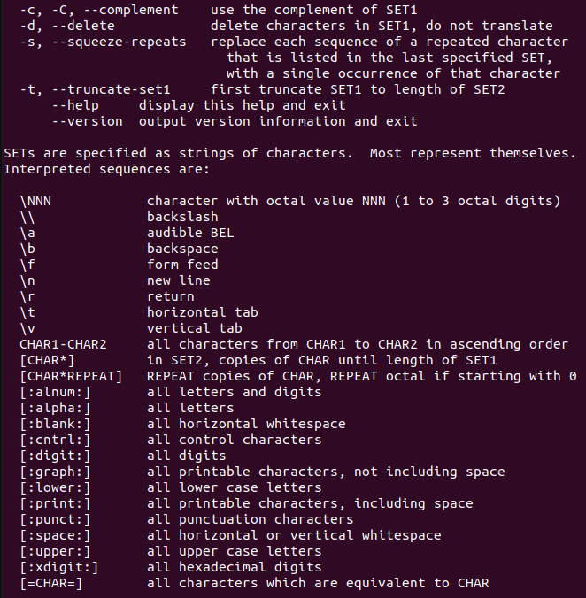

Là tool dò đường, tạo 1 packet đi từ host source tới host destination, giúp user biết packet đã đi đường nào, qua các hop nào mà pcket này đã thực hiện
```
traceoute [option] [ip/domain]
```
|option | mô tả|
|-----|-----|
|-4|ipv4|
|-6|ipv6|
|-F|chống phân mảnh|
|-g [gateway] |chỉ định packet đi qua gate|
|-f [fisrt-ttl]|bắt đầu từ hop có ttl đầu tiên được chỉ định (khác 1)|
|-m [max-ttl]|chỉ định packet qua số hop yêu cầu (max=30)|
|-n |không phân giải IP thành domain|
|-p |chỉ định port ở host destination dùng|
|packetlen| chỉ định độ dài packet (max=60)|
|-q [n]| chỉ định số lần dò khi qua 1 hop|

- kill/killall/pkill

Là lệnh ngắt tiến trình đang hoạt động trên hệ thống

```
kill/killall/pkill [option] [PID]
```
Trong đó: `killall` sẽ ngắt toàn bộ tiến trình mà có mang tên được chỉ định

Còn `pkill` sẽ gửi signal đến tiến trình dựa trên tên đó và  ngắt tiến trình mà có tên đầy đủ hoặc tên mẫu như chỉ định mà không cần dò PID cụ thể

- sort

Là lệnh sắp xếp nội dung của file bất kì
```
sort [option] [file-name]
```
|option | mô tả |
|-----|-----|
|-o|chuyển hướng output sang file được chỉ định|
|-r|sắp xếp ngược|
|-n|sắp xếp ký tự số|
|-nr|đảo ngược thứ tự với `-n`|
|-k [column+sort type]|sắp xếp dạng bảng có điều kiện|
|-u|sắp xếp và bỏ lặp|
|-M|xếp theo tháng|

- cut
```
cut OPTION... [FILE]...
```
Lệnh cho phép cắt ký tự trong cùng 1 mẫu nội dung của file từng byte, xem thêm ở `cut --help`

Ví dụ
```
$ cat state.txt
Andhra Pradesh
Arunachal Pradesh
Assam
Bihar
Chhattisgarh
```
với option `-b` tính bằng byte và phép thử :
```
$ cut -b 1,2,3 state.txt
And
Aru
Ass
Bih
Chh
```
với option `-c` cắt theo cột ký tự và phép thử :
```
$ cut -c 2,5,7 state.txt
nr
rah
sm
ir
hti
```
- uniq 

Là dòng lệnh báo cáo hoặc lọc các dòng nội dung bị trùng trong file
```
uniq [TÙY CHỌN] [INPUT[OUTPUT]]
```
Nếu user không chỉ định mục input và output, uniq sẽ dùng I/O tiêu chuẩn

-c – -count : Nó cho biết số lần một dòng được lặp lại bằng cách hiển thị một số dưới dạng tiền tố của dòng đó.

-d – -repeated : Nó chỉ in các dòng lặp lại chứ không in các dòng không lặp lại.

-D – -all-repeated[=method] : Nó in tất cả các dòng trùng lặp và [method] có thể là bất kỳ cách nào sau đây: 

    - none : Hoàn toàn không phân định các dòng trùng lặp. Đây là mặc định.

    - seperate : Chèn một dòng trống trước mỗi tập hợp các dòng trùng lặp.

    - riêng biệt : Chèn một dòng trống giữa mỗi tập hợp các dòng trùng lặp.

-f N – -skip-fields(N): Nó cho phép bạn bỏ qua N trường (một trường là một nhóm ký tự, được phân cách bằng khoảng trắng) của một dòng trước khi xác định tính duy nhất của một dòng.

-i – -ignore case : Theo mặc định, các phép so sánh được thực hiện có phân biệt chữ hoa chữ thường nhưng với tùy chọn này có thể thực hiện các phép so sánh không phân biệt chữ hoa chữ thường.

-s N – -skip-chars(N) : Nó không so sánh N ký tự đầu tiên của mỗi dòng trong khi xác định tính duy nhất. Điều này giống như tùy chọn -f, nhưng nó bỏ qua các ký tự riêng lẻ thay vì các trường.

-u – -unique : Nó cho phép bạn chỉ in các dòng duy nhất.

-z – -zero-terminated : Nó sẽ tạo một dòng kết thúc bằng 0 byte (NULL), thay vì một dòng mới.

-w N – -check-chars(N): Nó chỉ so sánh N ký tự trong một dòng.

– – help : Nó hiển thị một thông báo trợ giúp và thoát ra.

– – version : Nó hiển thị thông tin phiên bản và thoát.

- sed

Viết tắt của từ stream editor, là 1 lệnh cho phép chỉnh sửa ngay trên file như tìm, thay thế, sửa, xóa, chèn,... Điều mà __sed__ làm nhanh hơn các trình text editor thông thường như __vi__ hay __nano__ là __sed__ có thể chỉnh sửa ngay trên file mà không cần mở chúng, nhưng hầu hết user dùng __sed__ để tìm kiếm và thay thế

```
sed OPTIONS... [SCRIPT] [INPUTFILE...] 
```

 join, 
 diff, 
 xargs, 
 git, 


